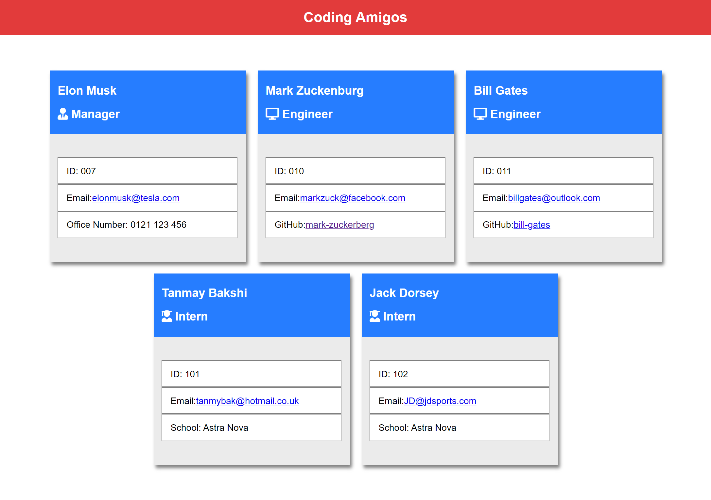

## **Table of Contents**

1.  [Description](#introduction)
2.  [Technologies Used](#technologies-used)
3.  [Packages Used](#packages-used)
4.  [Generated HTML Demo](#generate-html-demo)
5.  [User Flow](#user-flow)
6.  [How to run application](#how-to-run-application)
7.  [How to test application](#how-to-test-application)

## **Description**

In this project, I have created a Team Generator application usign `Node.js`, where users will be prompted to enter information reagarding employee's who are part of a structured team for a given project.

Users are asked to enter information such as their; `Name`, `EmployeeID`, `Email`; also including, `Office Number`, `GitHub Username` or `School`, if the user is either a **Manager**, **Engineer** or **Intern**.

For each employee added to a team, a card shall be dynamicaly be consructed to show the information inputed by a user, in the corresponding sections of a card, including links to social accounts (if they have any).

When a user is finished building a team, an HTML document will be generated for a user to easily view their constructed team cards, with all the corresponding information previously entered.

## **Technologies Used**

- HTML
- CSS
- JavaScript
- Node.js

## **Packages Used**

- Inquirer
- Jest (unit testing)

## **Generated HTML Demo**



## **User Flow**

- GIVEN a command-line application that accepts user input
- WHEN I am prompted for my team members and their information
- THEN an HTML file is generated that displays a nicely formatted team roster based on user input
- WHEN I click on an email address in the HTML
- THEN my default email program opens and populates the TO field of the email with the address
- WHEN I click on the GitHub username
- THEN that GitHub profile opens in a new tab
- WHEN I start the application
- THEN I am prompted to enter the team manager’s name, employee ID, email address, and office number
- WHEN I enter the team manager’s name, employee ID, email address, and office number
- THEN I am presented with a menu with the option to add an engineer or an intern or to finish building my team
- WHEN I select the engineer option
- THEN I am prompted to enter the engineer’s name, ID, email, and GitHub username, and I am taken back to the menu
- WHEN I select the intern option
- THEN I am prompted to enter the intern’s name, ID, email, and school, and I am taken back to the menu
- WHEN I decide to finish building my team
- THEN I exit the application, and the HTML is generated

## **How to run application**

```
npm run start
```

## **How to test application**

```
npm run test
```
